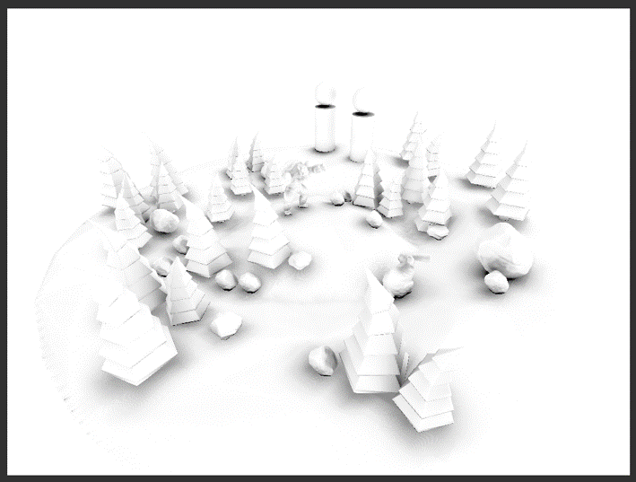

This project is using an offline SDF baker (SDFr), and maintaining global distance field at runtime.
Current shadowing functions run at about 120 fps, while I guess it would be more suitable for generally static scenes, which means that you'd better to use it for things that seldom change or move, to avoid efficiency problems. 
