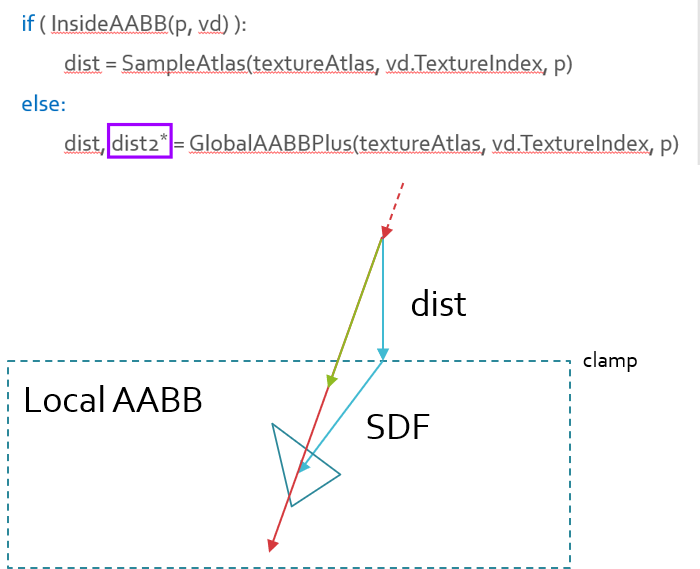

# DFAO-Unity

## Introduction
This project uses two-level hierarchical SDF and ray marching to render AO and soft shadow. 

The computation of objects' local SDF depends on [SDF baker (SDFr)](https://github.com/xraxra/SDFr). Beside local SDF's, a global SDF is maintained and lazily updated during runtime, guiding the beginning steps of ray marching, and roughly locating the movable objects.

## Usage

This repository is now upgraded to Unity 2021.3 .

Clone the code and open the scene in **Example/Scenes/RayMarchExample**, hit "Play", the runtime view should look like the screenshot below.

To play the demo with more custom meshes, you may 
1. Import the mesh as an object first, and then
2. Add the script component "SDF baker" to the object, which you could find in the project.
3. Use the SDFr tool, Encapsulate to optimize the bounding box, then bake distance field for the object
4. Remember to save the SDF data as asset.

Duplicates or instances of the object may be created, for runtime performance, it is recommended to have same or similar objects sharing the same SDF data.

## Thoughts

In this demo I use ray marching to create the AO and penumbra effect, casting view rays from the camera to the scene. 

The Distance function is represented by a two-level SDF structure, the step lenght of ray marching is first sampled from a Global Distance Field (GDF) and then the local SDF of adjancent objects.

To make smooth the transition between global SDF and local SDF inside object's bounding box, a conservative addition of the distances is introduced, to guarantee that the marching ray hits precisely the closest surface point of the object. 

However, conservative sum of distance is larger than "true" distance, possibly resulting in the extra marching steps, especially when the angle bewteen the view ray and the rim of the object's bounding box is close to 0 degree. 

Regarding the addition of global distance and local distance, we have a few discussions: using Sqrt root of 2-powered is still conservative and more precise, reducing the number of steps. 

## Stats

The current shadowing pass costs about 4-6ms on my Nvidia GTX 1660Ti, under HD resolution. 

Notice: this effect is closely related to screen size, due to the nature of ray marching algorithm. However, custom optimization can be applied for higher resolution, such as:
* Lower the sample rate,
* Use adaptive-resolution rendering (start from [here](https://gdcvault.com/play/1667/Mixed-Resolution) if interested), as AO and soft shadowing commonly require less precision.

In general, this method works better with static scene and limited number of moveable objects.

There are some slides with videos for this project [here](https://drive.google.com/file/d/10ICPY05gsmkJ11PfgKT2xEUlrhfY8__h/view?usp=sharing), noting the presentation was in Chinese and then converted into English, feel free to download at your needs. 

Discussions are also very welcome, for any thoughts or questions, please post in issues.

